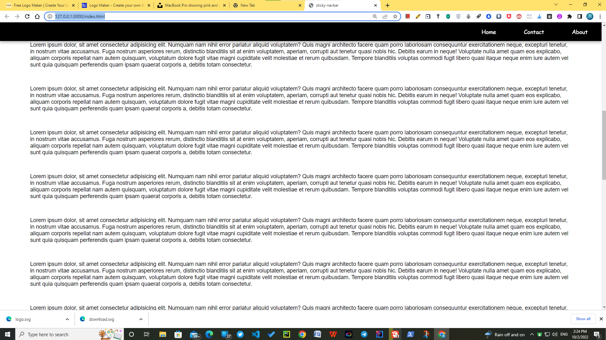

# Sticky navigation bar project

This transform the navbar when we when scroll down from top to bottom

## Before scrolling down


## After scrolling



## javascript funcition

```javascript
window.addEventListener("scroll", function () {
  // targetting the scroll dimenension "y" by window.scrollY
//   check the condition if this.window.scrollY is greater than the bottomContainerEl.offsetTop -
if (window.scrollY > bottomContainerEl.offsetTop - navBarEl.offsetHeight - 50) {
    // setting navbar "classList to active" can make the navbar color change  
    navBarEl.classList.add("active"); 

} else {
    navBarEl.classList.remove("active"); 
}
```


